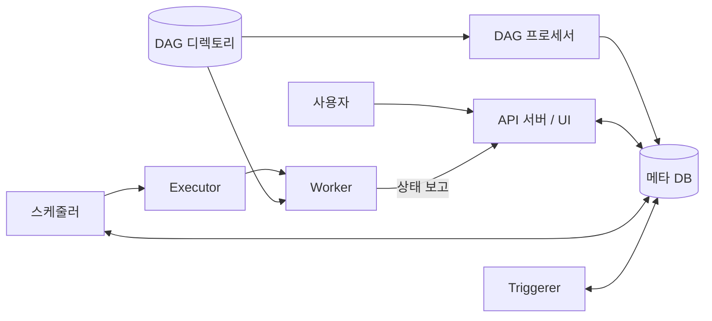
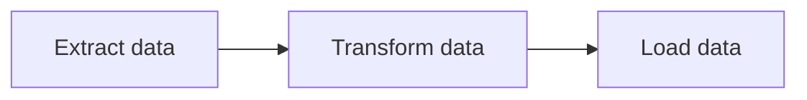
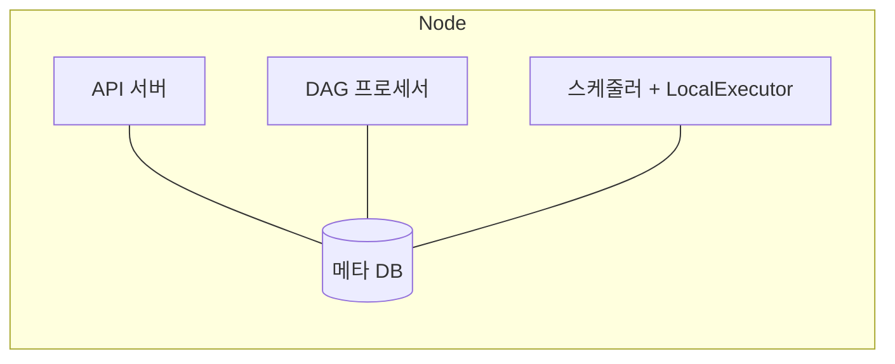
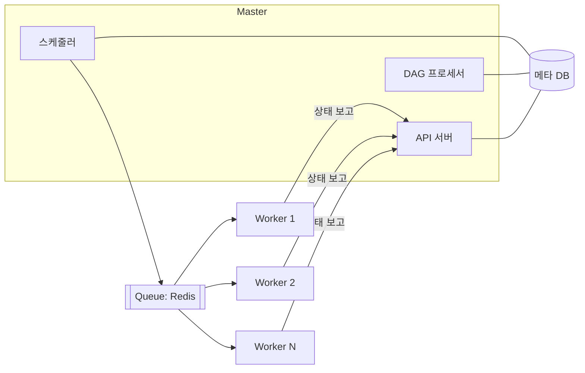
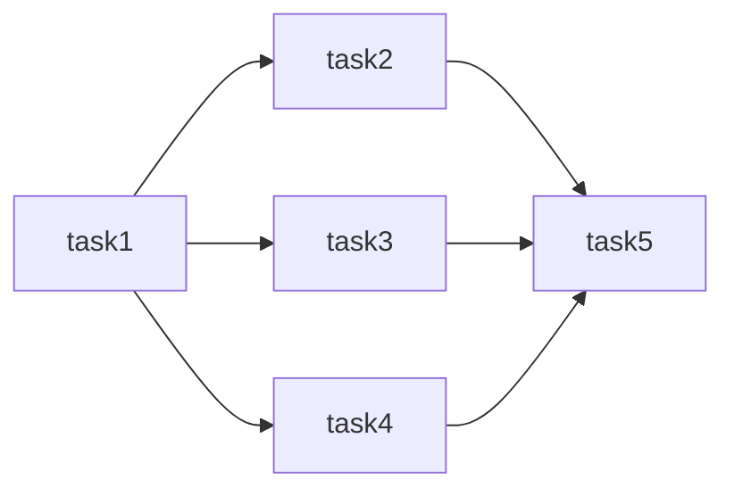

# Airflow 강의 노트

F-Lab Airflow 강의 내용을 정리한 노트입니다. **Airflow 3.3.2** 기준이며, 설치와 실습 방법은 [README.md](README.md)를 참고하세요.

- [1. 워크플로우 오케스트레이션이란](#1-워크플로우-오케스트레이션이란)
- [2. Apache Airflow 특징](#2-apache-airflow-특징)
- [3. Airflow 핵심 구성 요소](#3-airflow-핵심-구성-요소)
- [4. DAG](#4-dag)
- [5. Operator](#5-operator)
- [6. Airflow 아키텍처](#6-airflow-아키텍처)
- [7. Provider](#7-provider)
- [8. Sensor](#8-sensor)
- [9. Hook](#9-hook)
- [10. DAG 스케줄링](#10-dag-스케줄링)
- [11. Backfill & Catchup](#11-backfill--catchup)
- [12. TaskGroup & Label](#12-taskgroup--label)
- [13. XCom](#13-xcom)
- [14. Branch Operator](#14-branch-operator)
- [15. Trigger Rule](#15-trigger-rule)
- [16. Logical Date와 템플릿](#16-logical-date와-템플릿)
- [17. Tip](#17-tip)

---

## 1. 워크플로우 오케스트레이션이란

여러 데이터 파이프라인을 오케스트레이션하는 도구입니다.

- 파이프라인을 관리하고 실행을 조정하는 플랫폼
- 흐름을 **정의, 스케줄, 모니터링**하는 프레임워크 제공
- 다양한 파이프라인의 **의존성과 실행 순서** 관리

**주요 기능**

- **워크플로우 정의**: 파이프라인의 로직, 작업의 순서와 의존성
- **작업 스케줄링**: 정의된 순서대로 실행되도록 관리
- **의존성 관리**: 이전 작업의 성공/실패에 따라 다음 작업 실행 여부 결정
- **데이터 이동**
- **모니터링과 에러 핸들링**
- **확장성과 병렬 수행**

## 2. Apache Airflow 특징

- **파이썬으로 개발**: 워크플로우를 파이썬 코드로 정의
- **확장성**
- **의존성 관리**: DAG로 표현
- **모니터링 · 알림**: 웹 기반 UI 제공
- **확장성 · 통합성**: 다양한 빌트인 오퍼레이터 제공
  - SQL, Python, Bash, AWS EMR, Kubernetes, REST API
- **생태계와 커뮤니티**: 다양한 확장 오퍼레이터, 플러그인
- **DAG 시각화**
- **Fault Tolerance, Retries**
  - 자동 실패 탐지 및 재실행 정책 설정 가능
  - timeout 설정
  - 에러 핸들링 방법 정의가 쉬움
  - 탄력적인 파이프라인 구축이 쉬움

## 3. Airflow 핵심 구성 요소

| 구성 요소 | 실행 명령 | 역할 |
|---|---|---|
| **API 서버** | `airflow api-server` | UI 제공, 워크플로우 모니터링·관리. REST API와 워커용 Task Execution API도 제공 |
| **스케줄러** | `airflow scheduler` | DAG에 정의된 task 간 종속성을 고려해 task 실행을 지휘 |
| **DAG 프로세서** | `airflow dag-processor` | DAG 디렉토리의 파이썬 파일을 파싱해 메타 DB에 저장 |
| **메타 저장소 (Metadata DB)** | | DAG, task, 상태(state), XCom, Connection, Variable 저장 |
| **Executor** | | task를 **어떻게** 실행할지 결정. 병렬·분산 처리 수행 |
| **Worker** | `airflow celery worker` 등 | task가 실제로 실행되는 프로세스. Executor에 의해 정의됨 |
| **Triggerer** | `airflow triggerer` | Deferrable Operator를 위한 별도 프로세스 |

- **Executor 종류**: `LocalExecutor`, `CeleryExecutor`, `KubernetesExecutor`
- **Triggerer가 필요한 이유**: 외부 이벤트를 기다리는 동안 worker 슬롯을 계속 점유하면 자원이 낭비됩니다. Deferrable Operator는 대기 상태를 triggerer로 넘기고 worker 슬롯을 반납합니다.
- worker는 **API 서버(Task Execution API)** 를 통해 실행 상태(status)를 보고하고, API 서버가 메타 DB에 기록합니다. 태스크 코드는 메타 DB에 직접 접근하지 않습니다.



## 4. DAG

**DAG (Directed Acyclic Graph)** = 워크플로우

- **방향성이 있고 순환하지 않는** 그래프
- 데이터 파이프라인 또는 워크플로우를 정의하고 시각화하는 데 사용
- **노드 = task**, **간선 = task 간 의존 관계**

```
[task] → (dependency) → [task]
```

**파이썬 스크립트로 DAG를 정의**합니다.

- task와 dependency, 속성과 파라미터를 지정
- 스케줄(언제 실행될지)을 설정: 특정 시간 또는 크론 형식

```python
from datetime import datetime

from airflow.providers.standard.operators.empty import EmptyOperator
from airflow.providers.standard.operators.python import PythonOperator
from airflow.sdk import DAG

with DAG(
    dag_id="sample_dag",
    schedule="0 0 * * *",
    start_date=datetime(2026, 1, 1),
    catchup=False,
):
    task1 = PythonOperator(task_id="print_hello_task", python_callable=print_hello)
    task2 = EmptyOperator(task_id="empty_task")

    task1 >> task2
```

실습: `dags/1_first_dag.py`

**Task → Task Instance**: DAG에 정의된 task가 특정 실행(DAG Run)에서 실제로 실행된 것이 Task Instance입니다.

## 5. Operator

DAG 안의 개별 task입니다. task가 수행하는 **로직과 실행 방식**을 정의합니다.

| 분류 | 예시 |
|---|---|
| **Action Operator** (동작 수행) | `BashOperator`, `PythonOperator`, `EmailOperator`, `SQLExecuteQueryOperator` |
| **Transfer Operator** (데이터 이동) | `S3ToRedshiftOperator`, `S3FileTransformOperator` 등 |
| **Sensor Operator** (조건 대기) | `FileSensor`, `TimeSensor`, `SqlSensor`, `S3KeySensor` |

그 밖에 자주 쓰는 오퍼레이터: `EmptyOperator`(아무것도 하지 않는 자리 표시용), `HttpOperator`, `DockerOperator`, `SlackAPIOperator`

기본 오퍼레이터의 import 위치:

| 오퍼레이터 | import |
|---|---|
| `PythonOperator`, `BranchPythonOperator` | `airflow.providers.standard.operators.python` |
| `BashOperator` | `airflow.providers.standard.operators.bash` |
| `EmptyOperator` | `airflow.providers.standard.operators.empty` |
| `SQLExecuteQueryOperator` | `airflow.providers.common.sql.operators.sql` |
| `HttpOperator` | `airflow.providers.http.operators.http` |

**ETL 예시와 task 분리**



- 하나의 task에 Extract와 Transform을 함께 넣으면, Transform이 실패했을 때 **Extract도 다시 해야** 합니다.
- task를 나누면 **개별 예외 처리와 재처리(retry) 설정**이 가능합니다.

## 6. Airflow 아키텍처

**Single Node**: API 서버, 스케줄러, DAG 프로세서, 메타 DB가 한 머신에서 동작합니다. `LocalExecutor`로 같은 머신의 프로세스에서 task를 실행합니다. (README의 A 방법)



**Multi Node**: 스케줄러가 큐(예: Redis, RabbitMQ)에 task를 넣고, 여러 머신의 worker가 꺼내서 실행합니다. `CeleryExecutor` 구성입니다. (README의 B, C 방법)



## 7. Provider

Airflow에 특정 기능을 통합하는 패키지입니다.

- 외부 시스템·서비스와 통신할 수 있게 해 줌
- operator, hook, sensor 등을 제공
- 예: postgres, aws, spark, kubernetes
- 기본 오퍼레이터(`standard`)와 SQL 공통 기능(`common-sql`)도 provider로 제공되며 Airflow와 함께 설치됩니다.
- 목록: https://airflow.apache.org/docs/apache-airflow-providers/packages-ref.html

```bash
pip install apache-airflow-providers-amazon
pip install apache-airflow-providers-apache-spark
pip install apache-airflow-providers-postgres
```

Docker Compose 환경에서는 환경 변수로 추가 설치합니다 (빠른 테스트용. 운영에서는 이미지를 직접 빌드).

```yaml
_PIP_ADDITIONAL_REQUIREMENTS: ${_PIP_ADDITIONAL_REQUIREMENTS:- apache-airflow-providers-oracle apache-airflow-providers-microsoft-mssql}
```

## 8. Sensor

**어떤 조건이 만족될 때까지 실행을 멈추고 기다리는** 오퍼레이터입니다.

- 외부 이벤트, 시스템 변경 등을 기다릴 때 사용
- 다운스트림 task들이 실행될 조건이 갖춰졌는지 확인

**mode**

| mode | 동작 |
|---|---|
| `poke` (**기본값**) | worker 슬롯을 점유한 채 `poke_interval`마다 계속 조건을 확인 |
| `reschedule` | 조건이 안 맞으면 슬롯을 반납하고 `poke_interval` 뒤에 다시 스케줄됨. 대기 시간이 길 때 유리 |

```python
sql_sensor = SqlSensor(
    task_id="wait_for_condition",
    conn_id="my_postgres_connection",
    sql="SELECT COUNT(*) FROM sample_table WHERE key='hello1'",
    mode="reschedule",
    poke_interval=5,
)
```

실습: `dags/2_postgres_loader.py` (`key='hello1'` 행이 생길 때까지 대기)

## 9. Hook

외부 플랫폼과 쉽게 통신하게 해 주는 **고수준 인터페이스**입니다. 연결·인증 같은 low-level 코드를 직접 작성하지 않아도 됩니다.

```
SQLExecuteQueryOperator → PostgresHook → [DB]
```

Operator는 내부적으로 Hook을 사용합니다. PythonOperator 안에서 Hook을 직접 쓰면 더 세밀한 작업을 할 수 있습니다.

```python
from airflow.providers.postgres.hooks.postgres import PostgresHook

hook = PostgresHook(postgres_conn_id="my_postgres_connection")
hook.copy_expert(
    filename="/tmp/starwars_character.csv",
    sql="COPY starwars_character FROM stdin WITH DELIMITER as ','",
)
```

실습: `dags/3_http_dag.py`

## 10. DAG 스케줄링

- 스케줄러는 모든 task와 DAG를 모니터링합니다.
- 주기적으로 task들을 검사해서 실행 가능한 것을 실행합니다.
- DAG의 `schedule`과 `start_date`로 실행 시점이 정해집니다.
  - `schedule="0 0 * * *"` 또는 `"@daily"`처럼 크론을 주면 **그 시각에 DAG Run이 실행**됩니다.
  - 이 Run의 **logical date는 예약된 시각 그 자체**입니다. 예: `2026-07-02 00:00` 실행 → logical date `2026-07-02 00:00`
  - `start_date`는 이 시각 이후의 스케줄부터 실행한다는 시작점입니다.

```
start_date      실행 1                실행 2
07-01 00:00 ──▶ 07-01 00:00 ────────▶ 07-02 00:00
                (logical date 07-01)  (logical date 07-02)
```

크론 표현식 확인: https://crontab.guru/#0_4_*_*_* (매일 04:00)

| 프리셋 | 크론 |
|---|---|
| `@hourly` | `0 * * * *` |
| `@daily` | `0 0 * * *` |
| `@weekly` | `0 0 * * 0` |
| `@monthly` | `0 0 1 * *` |
| `None` | 스케줄 없음. 수동 실행이나 외부 트리거로만 실행 |

**데이터 구간 기준 스케줄**: "어제 하루치 데이터를 오늘 0시에 처리"처럼 **구간이 끝난 뒤 실행**하고 구간 정보(`data_interval_start` ~ `data_interval_end`)가 필요하면 `CronDataIntervalTimetable`을 씁니다.

```python
from airflow.timetables.interval import CronDataIntervalTimetable

with DAG(
    dag_id="daily_batch",
    schedule=CronDataIntervalTimetable("0 0 * * *", timezone="Asia/Seoul"),
    start_date=datetime(2026, 1, 1),
):
    ...
# 2026-07-02 00:00 실행 → data_interval 07-01 00:00 ~ 07-02 00:00, logical date 07-01
```

## 11. Backfill & Catchup

**Catchup**: DAG를 켰을 때 `start_date`부터 현재까지 **실행되지 않은 과거 스케줄을 자동으로 모두 실행**하는 동작입니다. 기본값은 `False`입니다.

```
start_date=07-01, 오늘=07-05 10:00, @daily

catchup=True  → 07-01, 07-02, 07-03, 07-04, 07-05 Run이 한꺼번에 생성
catchup=False → 가장 최근 스케줄(07-05) Run 1개만 생성
```

**Backfill**: 특정 과거 구간을 지정해서 **수동으로 실행**하는 것입니다. 스케줄러가 관리하며 UI(DAG 화면의 Backfill 버튼)와 CLI로 실행합니다.

```bash
airflow backfill create --dag-id sample_dag \
  --from-date 2026-07-01 --to-date 2026-07-05
```

## 12. TaskGroup & Label

- **TaskGroup**: 관련 task들을 UI에서 하나의 그룹으로 묶어 보여 줍니다. 그룹 단위로 `default_args`(예: `retries`)를 줄 수 있고, 그룹 안 task에서 개별로 덮어쓸 수 있습니다.
- **Label**: 의존성 간선에 설명을 붙여 UI 그래프에 표시합니다.

```python
from airflow.sdk import Label, task_group

@task_group(default_args={"retries": 3})
def group1():
    task1 = EmptyOperator(task_id="task1")          # retries=3 (그룹 기본값)
    task2 = BashOperator(task_id="task2", bash_command="echo Hello World!", retries=2)  # retries=2

group1() >> Label("When completed") >> task3
```

실습: `dags/4_task_group.py`

## 13. XCom

**XCom (Cross-Communication)**: task 간에 **작은 양의 데이터**를 주고받을 때 사용합니다.

- 대용량 데이터에는 적합하지 않음 (파일은 S3 등에 두고 경로만 전달)
- Airflow 메타 DB에 **key-value**로 저장
- `xcom_push` / `xcom_pull`
- PythonOperator의 **return 값은 자동으로 `return_value` 키로 push**됩니다
- `xcom_pull`에서 `task_ids`를 생략하면 **현재 task의 값만** 가져오므로, 다른 task의 값은 `task_ids`를 꼭 지정합니다

```python
def generate_number(**context):
    context["ti"].xcom_push(key="random_number", value=number)

def read_number(ti):
    number = ti.xcom_pull(key="random_number", task_ids="generate_number_task")
```

실습: `dags/5_xcom_dag.py`, `dags/3_http_dag.py` (HTTP 응답을 XCom으로 전달)

## 14. Branch Operator

조건에 따라 **다음에 실행할 task를 선택**합니다. callable이 실행할 `task_id`(또는 리스트)를 반환하면 나머지 경로는 `skipped`가 됩니다.

```python
def decide_which_path():
    if int(time.time()) % 2 == 0:
        return "even_path_task"
    return "odd_path_task"

branch_task = BranchPythonOperator(task_id="branch_task", python_callable=decide_which_path)
branch_task >> [even_path_task, odd_path_task]
```

실습: `dags/6_branch_dag.py`

> 분기 뒤에 다시 합쳐지는 task가 있다면, 기본 trigger rule(`all_success`)로는 skip된 경로 때문에 함께 skip됩니다. `none_failed_min_one_success`를 지정하세요.

## 15. Trigger Rule

업스트림 task들의 상태에 따라 **이 task를 실행할지** 결정하는 규칙입니다. 기본값은 `all_success`입니다.

| trigger_rule | 실행 조건 |
|---|---|
| `all_success` (기본) | 모든 업스트림 성공 |
| `all_failed` | 모든 업스트림 실패 또는 upstream_failed |
| `all_done` | 성공/실패와 관계없이 모든 업스트림 완료 |
| `all_skipped` | 모든 업스트림 skip |
| `one_success` | 업스트림 하나라도 성공하면 즉시 |
| `one_failed` | 업스트림 하나라도 실패하면 즉시 |
| `one_done` | 업스트림 하나라도 성공 또는 실패하면 즉시 |
| `none_failed` | 실패한 업스트림이 없음 (skip은 허용) |
| `none_failed_min_one_success` | 실패 없음 + 최소 1개 성공 (분기 후 합류에 사용) |
| `none_skipped` | skip된 업스트림이 없음 |
| `always` | 항상 실행 |

```python
from airflow.sdk import TriggerRule

task3 = EmptyOperator(task_id="task3", trigger_rule=TriggerRule.ONE_SUCCESS)
[task1, task2] >> task3
```

실습: `dags/7_trigger_rule.py`

문서: https://airflow.apache.org/docs/apache-airflow/stable/core-concepts/dags.html#trigger-rules

## 16. Logical Date와 템플릿

**logical date**는 DAG Run을 대표하는 날짜입니다. 스케줄 실행에서는 예약된 시각(10장), 수동 실행에서는 트리거한 시각이 됩니다. 이 값으로 "어느 날짜의 데이터를 처리할지"를 정합니다.

Jinja 템플릿과 task 컨텍스트로 접근합니다.

| 템플릿 변수 | 예시 값 |
|---|---|
| `{{ ds }}` | `2026-07-01` |
| `{{ ds_nodash }}` | `20260701` |
| `{{ logical_date }}` | `2026-07-01T00:00:00+00:00` |
| `{{ data_interval_start }}` / `{{ data_interval_end }}` | 처리 구간의 시작/끝 |
| `{{ dag_run.conf }}` | 수동 실행 시 넘긴 설정값 |
| `{{ params.p1 }}` | DAG/Task `params` |
| `{{ var.value.var1 }}` | Airflow Variable |

```python
BashOperator(task_id="print_days", bash_command="echo Days since {{ ds_nodash }}")

# PythonOperator는 함수 인자 이름과 같은 컨텍스트 값을 넘겨줍니다
def print_logical_date(logical_date, ds, data_interval_start, data_interval_end, **kwargs):
    ...
```

**logical date 기준 상대 날짜** (예: 2일 전 데이터 처리)

```python
# 템플릿
bash_command="echo {{ macros.ds_add(ds, -2) }}"          # ds=2026-07-10 → 2026-07-08

# 파이썬
def process(logical_date, macros, ds):
    target = logical_date - timedelta(days=2)              # 2026-07-08 00:00+00:00
    target_ds = macros.ds_add(ds, -2)                      # "2026-07-08"
```

> `start_date`는 "언제부터 스케줄할지"만 정하고, 각 Run이 처리할 날짜는 logical date로 계산합니다. 처리 날짜를 실행 시점에서 상대적으로 잡고 싶다면 `start_date`가 아니라 위처럼 logical date에서 계산합니다.

- `render_template_as_native_obj=True`: 템플릿 결과를 문자열이 아닌 **파이썬 객체(list, dict 등)** 로 렌더링합니다. (`11_templating.py`에서 `dag_run.conf['numbers']`를 리스트로 받을 때 사용)

실습: `dags/8_params_args.py`, `dags/10_logical_date.py`, `dags/11_templating.py`

문서: https://airflow.apache.org/docs/apache-airflow/stable/templates-ref.html

## 17. Tip

**의존성 fan-out / fan-in**

```python
task1 >> [task2, task3, task4] >> task5
```



**Variable은 묶어서 조회**: 여러 값을 따로 `Variable.get()` 하면 그만큼 조회가 일어납니다. JSON 하나로 묶어 한 번에 가져오세요. (`dags/9_access_variable.py`)

```python
from airflow.sdk import Variable

var_dict = Variable.get("var_dict", deserialize_json=True)
```

**Variable 조회는 task 안에서**: DAG 파일 최상단에서 `Variable.get()`을 호출하면 DAG 파일이 파싱될 때마다(기본 수십 초 간격) 조회가 일어납니다. task 함수 안이나 `{{ var.value.var1 }}` 템플릿으로 조회하세요.
