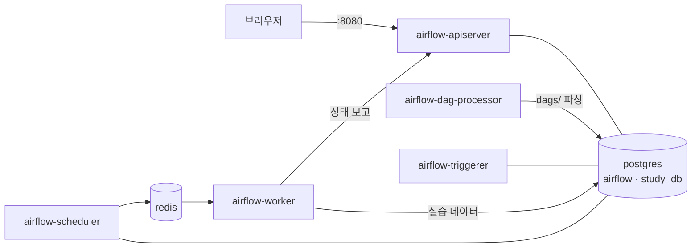

# Airflow Study

F-Lab Airflow 강의 실습 레포입니다. **Apache Airflow 3.3.2**를 Docker Compose로 실행합니다.

- 강의 노트: [LECTURE.md](LECTURE.md)

**학습 순서**: [LECTURE.md](LECTURE.md)로 개념을 익히고 → [시작하기](#시작하기)로 Airflow를 띄운 뒤 → `dags/`의 1번부터 12번까지 순서대로 실행해 봅니다.

## 목차

- [시작하기](#시작하기)
- [레포 구성](#레포-구성)
- [구성 설명](#구성-설명)
- [DAG 실행해 보기](#dag-실행해-보기)
- [실습 DB 접속](#실습-db-접속)
- [DAG 작성 팁](#dag-작성-팁)
- [정리 (Clean up)](#정리-clean-up)
- [트러블슈팅](#트러블슈팅)

## 시작하기

**필요한 것**: [Docker Desktop](https://www.docker.com/products/docker-desktop/) (메모리 4GB 이상 할당)

```bash
git clone https://github.com/f-lab-daniel/airflow_study.git
cd airflow_study

docker compose up -d
docker compose ps    # 모든 컨테이너가 (healthy)가 될 때까지 1~2분, airflow-init은 exited (0)
```

- Web UI: http://localhost:8080
- 계정: `airflow` / `airflow`

Connection, Variable, 실습 DB와 테이블은 모두 자동으로 준비되므로 바로 DAG를 실행할 수 있습니다.

## 레포 구성

| 경로 | 내용 | 강의 노트 |
|---|---|---|
| `dags/1_first_dag.py` | 첫 DAG: `PythonOperator` → `EmptyOperator` | [4. DAG](LECTURE.md#4-dag) |
| `dags/2_postgres_loader.py` | `SQLExecuteQueryOperator`로 INSERT, `SqlSensor`로 조건 대기 | [8. Sensor](LECTURE.md#8-sensor) |
| `dags/3_http_dag.py` | `HttpOperator`로 SWAPI 호출 → XCom → CSV → `PostgresHook.copy_expert` | [9. Hook](LECTURE.md#9-hook) |
| `dags/4_task_group.py` | `@task_group`, `Label` | [12. TaskGroup](LECTURE.md#12-taskgroup--label) |
| `dags/5_xcom_dag.py` | `xcom_push` / `xcom_pull` | [13. XCom](LECTURE.md#13-xcom) |
| `dags/6_branch_dag.py` | `BranchPythonOperator` | [14. Branch](LECTURE.md#14-branch-operator) |
| `dags/7_trigger_rule.py` | `TriggerRule.ONE_SUCCESS` | [15. Trigger Rule](LECTURE.md#15-trigger-rule) |
| `dags/8_params_args.py` | DAG/Task `params` 템플릿 | [16. 템플릿](LECTURE.md#16-logical-date와-템플릿) |
| `dags/9_access_variable.py` | `Variable.get()` | [17. Tip](LECTURE.md#17-tip) |
| `dags/10_logical_date.py` | `logical_date`, `ds`, `data_interval_start/end`, logical date 기준 2일 전 | [16. Logical Date](LECTURE.md#16-logical-date와-템플릿) |
| `dags/11_templating.py` | Jinja 템플릿, `dag_run.conf`, `render_template_as_native_obj` | [16. 템플릿](LECTURE.md#16-logical-date와-템플릿) |
| `dags/12_spark_k8s.py`, `dags/sample.yaml` | `SparkKubernetesOperator`로 SparkApplication 제출 (EKS 필요) | [7. Provider](LECTURE.md#7-provider) |
| `docker-compose.yaml` | 공식 Airflow 3.3.2 Compose + 이 레포용 설정 | |
| `initdb/study_db.sql` | 실습 DB `study_db`와 테이블 생성 SQL (PostgreSQL 최초 실행 시 자동 실행) | |
| `logs/` | 태스크 실행 로그 (컨테이너에서 자동 생성, git 제외) | |

## 구성 설명

`docker compose up -d`로 아래 컨테이너가 뜹니다. CeleryExecutor 구성이라 [강의 노트 6장](LECTURE.md#6-airflow-아키텍처)의 Multi Node 구조와 같습니다.



| 컨테이너 | 역할 |
|---|---|
| `airflow-apiserver` | Web UI + REST API (http://localhost:8080) |
| `airflow-scheduler` | DAG Run 생성, 실행할 태스크를 Redis 큐에 전달 |
| `airflow-dag-processor` | `dags/`의 파이썬 파일을 파싱해 DB에 저장 |
| `airflow-worker` | 큐에서 태스크를 꺼내 실행 (Celery 워커) |
| `airflow-triggerer` | Deferrable Operator의 대기 처리 |
| `redis` | Celery 브로커 (태스크 큐) |
| `postgres` (16) | `airflow`: Airflow 메타데이터 DB<br>`study_db`: DAG 실습 DB (호스트 포트 `5433`) |
| `airflow-init` | 최초 1회 DB 마이그레이션, 관리자 계정 생성 후 종료 |

**레포 폴더 마운트**

| 레포 | 컨테이너 | 이유 |
|---|---|---|
| `dags/` | `/opt/airflow/dags` | DAG 코드를 수정하면 컨테이너에 바로 반영됩니다 (반영까지 수십 초) |
| `logs/` | `/opt/airflow/logs` | 워커가 쓴 로그를 UI가 읽을 수 있게 공유합니다. 컨테이너를 지워도 남습니다 |

**자동으로 준비되는 것** (`docker-compose.yaml`의 환경 변수와 `initdb/`)

| 항목 | 값 |
|---|---|
| Connection `my_postgres_connection` | `postgres:5432` / `study_db` / `study_user` |
| Connection `my_http_connection` | `https://swapi.dev` |
| Variable `var1`, `var2`, `var_dict` | `value1`, `value2`, `{"var1": "value1", "var2": "value2"}` |
| 실습 DB `study_db` | 테이블 `sample_table`, `starwars_character` |

> 환경 변수(`AIRFLOW_CONN_*`, `AIRFLOW_VAR_*`)로 등록한 Connection·Variable은 메타 DB에 저장되지 않아 **UI의 Admin 목록에는 보이지 않습니다.** DAG에서는 정상적으로 사용됩니다. CLI로 확인할 수 있습니다:
> ```bash
> docker compose exec airflow-scheduler airflow connections get my_postgres_connection
> docker compose exec airflow-scheduler airflow variables get var1
> ```

## DAG 실행해 보기

**UI에서**: DAG 목록에서 토글을 켜고(unpause) ▶ 버튼으로 실행합니다. DAG는 기본적으로 일시정지 상태로 등록됩니다. 실행 후 태스크를 클릭하면 로그를 볼 수 있습니다.

> 스케줄이 있는 DAG는 unpause하는 순간 가장 최근 스케줄 1회가 바로 실행됩니다. 여기에 수동 실행까지 하면 2번 실행되므로, `http_dag`처럼 데이터를 쌓는 DAG는 결과 행이 2개가 될 수 있습니다.

**CLI에서**: Airflow CLI는 컨테이너 안에서 실행합니다.

```bash
# 스케줄러 없이 DAG 전체를 한 번 실행 (디버깅용, 결과가 바로 터미널에 출력)
docker compose exec airflow-scheduler airflow dags test sample_dag

# 스케줄러를 통해 실행
docker compose exec airflow-scheduler airflow dags unpause sample_dag
docker compose exec airflow-scheduler airflow dags trigger sample_dag
docker compose exec airflow-scheduler airflow dags list-runs sample_dag

# 태스크 하나만 실행
docker compose exec airflow-scheduler airflow tasks test sample_dag print_hello_task
```

자주 쓴다면 별칭을 만들어 두면 편합니다: `alias af='docker compose exec airflow-scheduler airflow'` → `af dags list`

**DAG별 메모**

| DAG | 확인할 것 |
|---|---|
| `postgres_loader` | `SqlSensor`가 `key='hello1'` 행이 생길 때까지 대기합니다. [실습 DB 접속](#실습-db-접속) 후 `INSERT INTO sample_table (key, value) VALUES ('hello1', 'world1');` |
| `http_dag` | 실행 후 `SELECT * FROM starwars_character;` → `Luke Skywalker \| 172 \| 77` |
| `xcom_dag` | 로그에서 `Generated number: N` 과 `Received number: N` 이 같은 값 |
| `branch_operator_dag` | 짝수/홀수 경로 중 하나만 실행되고 나머지는 `skipped` |
| `params_argument` | 로그에 `v1`, `v2 v3` |
| `access_variable` | 로그에 `value1`, `value2` |
| `templating` | conf를 넣어 실행: `airflow dags trigger templating -c '{"numbers": [1, 2, 3]}'` → `sum_numbers1`, `sum_numbers2` 반환값 6 |
| `print_logical_date` | 2분마다 실행되며 `logical_date`, `data_interval`, 2일 전 날짜 출력 |
| `spark_submit_sample` | EKS 클러스터가 필요합니다 (강의 환경 전용). `eks-flab` Connection을 Kubernetes 타입으로 만들고 Extra의 `kube_config`에 kubeconfig 내용을 넣습니다 |

## 실습 DB 접속

```bash
docker compose exec postgres psql -U study_user -d study_db
```

```sql
SELECT * FROM sample_table;
SELECT * FROM starwars_character;
\q   -- psql 종료
```

DBeaver, DataGrip 같은 GUI 도구로는 `localhost:5433`, DB `study_db`, 사용자 `study_user` / `study_pass`로 접속합니다.

## DAG 작성 팁

**IDE 자동완성**: DAG 코드는 컨테이너에서 실행되지만, 에디터에서 import 자동완성과 오류 표시를 쓰려면 Mac에도 Airflow 패키지를 설치해 둡니다 (실행용이 아니라 편집용).

```bash
# https://docs.astral.sh/uv/ 의 uv 사용
uv venv --python 3.12
uv pip install "apache-airflow[postgres,http,cncf.kubernetes]==3.3.2" \
  --constraint "https://raw.githubusercontent.com/apache/airflow/constraints-3.3.2/constraints-3.12.txt"
```

에디터의 Python 인터프리터를 `.venv/bin/python`으로 지정하면 됩니다 (`.venv/`는 git 제외).

**import 경로 검사 (Ruff)**: 인터넷 예제나 오래된 블로그 코드는 Airflow 3에서 없어진 import 경로를 쓰는 경우가 많습니다. [Ruff](https://docs.astral.sh/ruff/)의 `AIR3` 규칙으로 확인할 수 있습니다.

```bash
uvx ruff check dags/ --select AIR3 --preview          # 검사 → All checks passed!
uvx ruff check dags/ --select AIR3 --preview --fix    # 자동 수정 가능한 항목 수정
```

**DAG 오류 확인**: 새 DAG가 UI에 안 보이면 파싱 오류일 가능성이 큽니다.

```bash
docker compose exec airflow-scheduler airflow dags list-import-errors
```

## 정리 (Clean up)

필요한 단계까지만 실행하세요. 아래로 갈수록 더 많이 지웁니다.

```bash
# 1) 멈추기: 컨테이너만 삭제. DB 데이터는 남아서 다음 up에서 이어서 사용
docker compose down

# 2) 데이터 초기화: DB 볼륨과 로그까지 삭제. 다음 up에서 DB와 실습 테이블을 새로 만듦
docker compose down -v
rm -rf logs/*

# 3) 완전 삭제: Docker 이미지와 편집용 가상환경까지 삭제
docker compose down -v --rmi all
rm -rf logs/* .venv
```

> `--rmi all`은 `apache/airflow:3.3.2`, `postgres:16`, `redis:7.2-bookworm` 이미지를 지웁니다. 다른 프로젝트에서 같은 이미지를 쓰고 있다면 빼세요.

남은 것이 없는지 확인:

```bash
docker ps -a --filter name=airflow_study
docker volume ls --filter name=airflow_study
```

## 트러블슈팅

| 증상 | 원인 / 해결 |
|---|---|
| `docker compose ps`에서 계속 `(starting)` / `unhealthy` | Docker Desktop 메모리가 부족. Settings → Resources에서 4GB 이상으로 올린 뒤 `docker compose down && docker compose up -d` |
| `port is already allocated` (8080 또는 5433) | 다른 프로그램이 포트 사용 중. `lsof -i :8080` / `lsof -i :5433`으로 확인 후 종료 |
| `postgres` 컨테이너 unhealthy, 로그에 `database files are incompatible with server` | 다른 PostgreSQL 버전으로 만든 볼륨이 남아 있음. `docker compose down -v` 후 다시 `up` |
| `relation "sample_table" does not exist` | `initdb/`가 실행되지 않은 이전 볼륨. `docker compose down -v` 후 다시 `up` |
| DAG가 UI에 안 보임 | 파싱 오류: `airflow dags list-import-errors`. 새 파일은 반영까지 수십 초 걸릴 수 있음 |
| 태스크가 `queued`에서 멈춤 | `docker compose ps`로 `airflow-worker`가 healthy인지 확인. `docker compose logs airflow-worker` |
| UI에서 태스크 로그가 안 보임 | `logs/` 마운트 확인 (`docker compose config | grep logs`) |
| SWAPI 호출 실패 | `swapi.dev`가 간헐적으로 응답하지 않습니다. `docker-compose.yaml`의 `AIRFLOW_CONN_MY_HTTP_CONNECTION` host를 미러 `swapi.info`로 바꾼 뒤 `docker compose up -d` |

로그 보기: `docker compose logs -f airflow-scheduler` (다른 서비스도 같은 방식)

## 참고 자료

- [Airflow 3.3.2 문서](https://airflow.apache.org/docs/apache-airflow/stable/index.html) · [Release Notes](https://airflow.apache.org/docs/apache-airflow/stable/release_notes.html)
- [Running Airflow in Docker](https://airflow.apache.org/docs/apache-airflow/stable/howto/docker-compose/index.html)
- [Managing Connections (환경 변수)](https://airflow.apache.org/docs/apache-airflow/stable/howto/connection.html#storing-connections-in-environment-variables) · [Variables](https://airflow.apache.org/docs/apache-airflow/stable/howto/variable.html#storing-variables-in-environment-variables)
- [Celery Executor](https://airflow.apache.org/docs/apache-airflow-providers-celery/stable/celery_executor.html)
