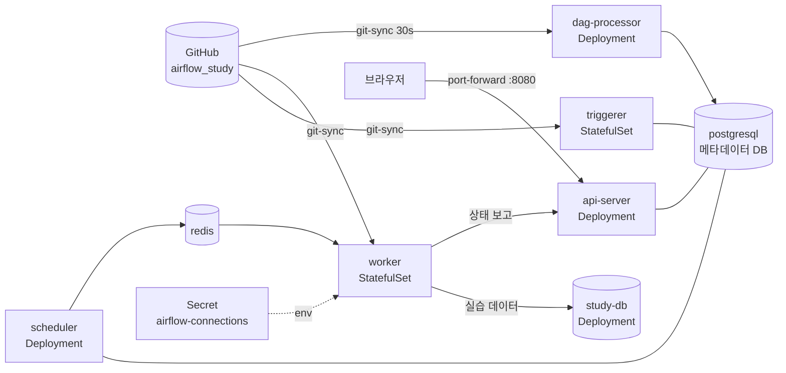

# Airflow on Kubernetes

이 레포의 DAG를 **Kubernetes**에 Airflow 3.3.2로 배포하고 활용하는 가이드입니다. [Apache Airflow 공식 Helm 차트](https://airflow.apache.org/docs/helm-chart/stable/index.html) 1.22.0을 사용합니다.

로컬 실습은 레포 루트의 [README.md](../README.md)(Docker Compose)로 충분합니다. 이 문서는 같은 구성을 Kubernetes로 옮기고, Kubernetes에서만 가능한 기능(KubernetesExecutor, KubernetesPodOperator)을 써 보는 단계입니다.

## 목차

- [Docker Compose와 무엇이 다른가](#docker-compose와-무엇이-다른가)
- [디렉토리 구성](#디렉토리-구성)
- [사전 준비](#사전-준비)
- [빠른 시작 (kind 로컬 클러스터)](#빠른-시작-kind-로컬-클러스터)
- [구성 설명](#구성-설명)
- [Executor 선택: Celery vs Kubernetes](#executor-선택-celery-vs-kubernetes)
- [Kubernetes 활용: KubernetesPodOperator](#kubernetes-활용-kubernetespodoperator)
- [자주 쓰는 명령](#자주-쓰는-명령)
- [설정 변경과 업그레이드](#설정-변경과-업그레이드)
- [정리 (Clean up)](#정리-clean-up)
- [운영 환경 체크리스트](#운영-환경-체크리스트)
- [트러블슈팅](#트러블슈팅)

## Docker Compose와 무엇이 다른가

| 항목 | Docker Compose (레포 루트) | Kubernetes (이 디렉토리) |
|---|---|---|
| 설치 | `docker compose up -d` | `helm upgrade --install` (공식 Helm 차트) |
| DAG 전달 | `dags/` 폴더 마운트 | **git-sync**: Git 저장소의 `dags/`를 주기적으로 받아옴 → `git push`하면 반영 |
| Connection / Variable | `bootstrap/` 파일을 메타 DB에 import (UI에 보임) | Kubernetes **Secret** → 환경 변수로 주입 (UI 목록에는 안 보임) |
| 실습 DB | compose의 postgres에 `initdb/` | 별도 Deployment (`manifests/study-db.yaml`) |
| Executor | CeleryExecutor 고정 | CeleryExecutor 또는 **KubernetesExecutor** (태스크마다 Pod) |
| 확장 | 컨테이너 수 고정 | `workers.replicas`, HPA, KEDA로 워커 수 조절 |
| 추가 기능 | | **KubernetesPodOperator**: 태스크를 원하는 이미지의 Pod로 실행 |

## 디렉토리 구성

```
k8s/
├── README.md                          # 이 문서
├── kind-cluster.yaml                  # 실습용 로컬 클러스터 설정 (kind)
├── values.yaml                        # Helm 차트 values: Airflow 3.3.2, CeleryExecutor, git-sync
├── values-kubernetes-executor.yaml    # KubernetesExecutor로 바꿀 때 덧붙이는 values
└── manifests/
    ├── airflow-secrets.yaml           # 컴포넌트 공유 보안 키 (api secret key, JWT secret)
    ├── airflow-connections.yaml       # Connection / Variable (AIRFLOW_CONN_*, AIRFLOW_VAR_*)
    └── study-db.yaml                  # DAG 실습용 PostgreSQL (study_db)
```

Kubernetes 전용 예제 DAG: [`dags/13_kubernetes_pod_operator.py`](../dags/13_kubernetes_pod_operator.py)

## 사전 준비

| 도구 | 용도 | 설치 |
|---|---|---|
| Docker Desktop | kind 노드 실행 (메모리 6GB 이상, **디스크 여유 10GB 이상** 권장) | https://www.docker.com/products/docker-desktop/ |
| kind | 로컬 Kubernetes 클러스터 | `brew install kind` |
| kubectl | 클러스터 조작 | `brew install kubectl` |
| Helm | 차트 설치 (v3.19 이상) | `brew install helm` |

차트 1.22.0 요구 사항: Kubernetes 1.30.13 이상, Helm 3.19 이상

> 이미 EKS, GKE 같은 클러스터가 있다면 kind 단계를 건너뛰고 `kubectl config use-context <클러스터>`로 대상 클러스터를 선택한 뒤 [2단계](#2-네임스페이스와-사전-리소스-생성)부터 진행합니다.

## 빠른 시작 (kind 로컬 클러스터)

모든 명령은 **레포 루트**에서 실행합니다.

### 1. 클러스터 생성

```bash
kind create cluster --config k8s/kind-cluster.yaml
kubectl config current-context   # kind-airflow-study
kubectl get nodes                # airflow-study-control-plane   Ready
```

(선택) Airflow 이미지는 2GB가 넘어서 클러스터 안에서 받으면 오래 걸립니다. Docker Compose 실습으로 이미 받아 두었다면 kind 노드로 복사해 시간을 줄일 수 있습니다.

```bash
docker pull apache/airflow:3.3.2
kind load docker-image apache/airflow:3.3.2 --name airflow-study
```

### 2. 네임스페이스와 사전 리소스 생성

Helm 설치 전에 values.yaml이 참조하는 Secret과 실습 DB를 먼저 만듭니다.

```bash
kubectl create namespace airflow

kubectl apply -f k8s/manifests/airflow-secrets.yaml       # 보안 키
kubectl apply -f k8s/manifests/airflow-connections.yaml   # Connection / Variable
kubectl apply -f k8s/manifests/study-db.yaml              # 실습 DB

kubectl get pods -n airflow   # study-db-xxxx   1/1 Running
```

### 3. Airflow 설치

```bash
helm repo add apache-airflow https://airflow.apache.org
helm repo update

helm upgrade --install airflow apache-airflow/airflow \
  --namespace airflow \
  --version 1.22.0 \
  -f k8s/values.yaml \
  --timeout 15m
```

설치 중에 DB 마이그레이션 Job과 관리자 계정 생성 Job이 실행됩니다. 모든 Pod가 Running이 될 때까지 5~10분 걸립니다(이미지 다운로드 포함).

```bash
kubectl get pods -n airflow -w   # Ctrl+C로 종료
```

```
NAME                                    READY   STATUS
airflow-api-server-xxxx                 1/1     Running
airflow-dag-processor-xxxx              3/3     Running     # dag-processor + git-sync + log-groomer
airflow-postgresql-0                    1/1     Running     # 메타데이터 DB
airflow-redis-0                         1/1     Running
airflow-scheduler-xxxx                  2/2     Running
airflow-statsd-xxxx                     1/1     Running
airflow-triggerer-0                     3/3     Running
airflow-worker-0                        3/3     Running
study-db-xxxx                           1/1     Running
```

### 4. Web UI 접속

```bash
kubectl port-forward svc/airflow-api-server 8080:8080 -n airflow
```

- http://localhost:8080
- 계정: `admin` / `admin` (`values.yaml`의 `createUserJob.defaultUser`)

> 레포 루트의 Docker Compose가 떠 있으면 8080 포트가 겹칩니다. `docker compose down` 하거나 `8081:8080`처럼 다른 로컬 포트를 쓰세요.

UI에 `dags/`의 DAG들이 보이면 성공입니다. git-sync는 GitHub의 `main` 브랜치를 받아오므로, 로컬에서 수정한 DAG는 `git push` 해야 나타납니다. 이후 실행 방법은 레포 루트 README의 [DAG 실행해 보기](../README.md#dag-실행해-보기)와 같고, CLI는 아래처럼 Pod 안에서 실행합니다.

```bash
kubectl exec -n airflow deploy/airflow-scheduler -c scheduler -- airflow dags list
kubectl exec -n airflow deploy/airflow-scheduler -c scheduler -- airflow dags test sample_dag
```

## 구성 설명

### 배포되는 리소스



| 리소스 | 종류 | 역할 |
|---|---|---|
| `airflow-api-server` | Deployment + Service | Web UI, REST API, 워커용 Task Execution API |
| `airflow-scheduler` | Deployment | DAG Run 생성, 태스크를 Executor에 전달 |
| `airflow-dag-processor` | Deployment | DAG 파일 파싱 |
| `airflow-triggerer` | StatefulSet | Deferrable Operator 대기 처리 |
| `airflow-worker` | StatefulSet | Celery 워커 (CeleryExecutor일 때). 태스크 로그를 PVC에 저장 |
| `airflow-redis` | StatefulSet | Celery 브로커 (CeleryExecutor일 때) |
| `airflow-postgresql` | StatefulSet | Airflow 메타데이터 DB (실습용 내장 DB) |
| `airflow-statsd` | Deployment | 메트릭 수집 (Prometheus 형식) |
| `airflow-run-airflow-migrations` | Job | 설치·업그레이드 시 DB 마이그레이션 |
| `airflow-create-user` | Job | 최초 관리자 계정 생성 |
| `study-db` | Deployment + Service + PVC | DAG 실습 DB (`manifests/study-db.yaml`) |

### values.yaml 주요 항목

| 항목 | 값 | 설명 |
|---|---|---|
| `airflowVersion`, `defaultAirflowTag` | `3.3.2` | 차트 1.22.0의 기본값은 3.2.2라서 명시적으로 지정 |
| `executor` | `CeleryExecutor` | [Executor 선택](#executor-선택-celery-vs-kubernetes) 참고 |
| `apiSecretKeySecretName`, `jwtSecretName` | Secret 이름 | 모든 컴포넌트가 같은 키를 쓰도록 미리 만든 Secret 사용 |
| `createUserJob.defaultUser` | `admin` / `admin` | 최초 관리자 계정 |
| `dags.gitSync` | 이 레포 `main` 브랜치의 `dags/` | DAG 배포 방식 |
| `extraEnvFrom` | `airflow-connections` Secret | Connection / Variable 주입 |
| `postgresql.enabled` | `true` | 실습용 내장 메타데이터 DB |

### DAG 배포 방식

이 가이드는 **git-sync**를 씁니다. DAG 파일이 필요한 Pod(dag-processor, worker, triggerer, KubernetesExecutor의 태스크 Pod)에 git-sync 컨테이너가 붙어 `period`(30초)마다 저장소를 받아옵니다. Airflow 3에서는 scheduler와 api-server가 DAG 파일을 직접 읽지 않으므로 git-sync가 붙지 않습니다.

```
DAG 수정 → git push origin main → 최대 30초 후 모든 Pod에 반영 → dag-processor가 파싱
```

| 방식 | 설정 | 장점 | 단점 |
|---|---|---|---|
| **git-sync** (이 가이드) | `dags.gitSync` | push만 하면 반영, 이력 관리 | Git 저장소 접근 필요 |
| 이미지에 포함 | `images.airflow.repository/tag` | 버전이 이미지에 고정되어 재현성 높음 | DAG 수정마다 이미지 빌드·배포 |
| PVC | `dags.persistence` | 단순 | PVC에 파일을 넣는 방법을 따로 마련해야 함, ReadWriteMany 필요 |

private 저장소라면 Secret을 만들고 `dags.gitSync.credentialsSecret`(HTTPS 토큰) 또는 `dags.gitSync.sshKeySecret`(SSH 키)을 지정합니다.

```bash
kubectl create secret generic git-credentials -n airflow \
  --from-literal=GITSYNC_USERNAME=<github-id> \
  --from-literal=GITSYNC_PASSWORD=<personal-access-token>
```

> 직접 fork한 저장소로 실습하려면 `values.yaml`의 `dags.gitSync.repo`를 내 저장소 주소로 바꿔 주세요.

### Connection · Variable

`manifests/airflow-connections.yaml` Secret의 키가 모든 Airflow 컨테이너(태스크 Pod 포함)에 환경 변수로 들어갑니다.

| 환경 변수 | 결과 |
|---|---|
| `AIRFLOW_CONN_MY_POSTGRES_CONNECTION` | Connection `my_postgres_connection` → `study-db` Service |
| `AIRFLOW_CONN_MY_HTTP_CONNECTION` | Connection `my_http_connection` → `https://swapi.dev` |
| `AIRFLOW_VAR_VAR1`, `AIRFLOW_VAR_VAR2`, `AIRFLOW_VAR_VAR_DICT` | Variable `var1`, `var2`, `var_dict` |

Secret을 수정한 뒤에는 Pod를 재시작해야 반영됩니다.

```bash
kubectl apply -f k8s/manifests/airflow-connections.yaml
kubectl rollout restart deploy/airflow-scheduler deploy/airflow-dag-processor deploy/airflow-api-server sts/airflow-worker sts/airflow-triggerer -n airflow
```

> UI의 Admin → Connections에서 직접 등록해도 됩니다. 이 경우 메타데이터 DB에 저장되고, 환경 변수로 등록한 값과 달리 UI 목록에 보입니다.

## Executor 선택: Celery vs Kubernetes

| | CeleryExecutor (`values.yaml`) | KubernetesExecutor (`+ values-kubernetes-executor.yaml`) |
|---|---|---|
| 태스크 실행 위치 | 항상 떠 있는 워커 Pod (StatefulSet) | **태스크마다 새 Pod** 생성 후 삭제 |
| 시작 지연 | 거의 없음 | Pod 생성 시간(수 초~수십 초) |
| 유휴 자원 | 워커가 계속 자원 사용 | 태스크가 없으면 자원 사용 없음 |
| 태스크별 자원 지정 | 워커 단위 | 태스크마다 CPU/메모리/이미지 지정 가능 (`executor_config`) |
| 필요한 구성 | Redis + 워커 | 없음 (Redis, 워커 StatefulSet이 생성되지 않음) |
| 적합한 경우 | 짧은 태스크가 많을 때 | 태스크마다 자원 요구가 다르거나 실행이 드문드문할 때 |

**KubernetesExecutor로 전환**

```bash
helm upgrade --install airflow apache-airflow/airflow \
  --namespace airflow --version 1.22.0 \
  -f k8s/values.yaml -f k8s/values-kubernetes-executor.yaml \
  --timeout 15m
```

DAG를 실행하면 태스크마다 Pod가 생기는 것을 볼 수 있습니다.

```bash
kubectl get pods -n airflow -w
# sample-dag-print-hello-task-xxxxxxxx   0/1   Completed
```

> `values-kubernetes-executor.yaml`은 실습을 위해 끝난 태스크 Pod를 지우지 않도록(`delete_worker_pods: 'False'`) 설정합니다. UI가 태스크 로그를 Pod에서 직접 읽기 때문입니다. 완료된 Pod가 쌓이면 `kubectl delete pod -n airflow --field-selector=status.phase==Succeeded`로 지웁니다. 운영 환경에서는 Pod를 지우고 [원격 로깅](#운영-환경-체크리스트)을 설정합니다.

CeleryExecutor로 돌아가려면 `-f k8s/values-kubernetes-executor.yaml`을 빼고 다시 `helm upgrade` 합니다.

## Kubernetes 활용: KubernetesPodOperator

[`dags/13_kubernetes_pod_operator.py`](../dags/13_kubernetes_pod_operator.py)는 태스크를 **Airflow 이미지가 아닌 원하는 이미지**의 Pod로 실행합니다. 언어나 라이브러리 버전이 Airflow와 달라도 되고, 무거운 작업을 Airflow 워커와 분리할 수 있습니다.

```python
KubernetesPodOperator(
    task_id="hello_pod",
    name="hello-pod",
    image="alpine:3.20",                 # 아무 이미지나 사용 가능
    cmds=["sh", "-c"],
    arguments=["echo Hello from $(hostname)"],
    in_cluster=True,                     # Airflow가 실행 중인 클러스터에 Pod 생성
    get_logs=True,                       # Pod 로그를 태스크 로그로 가져옴
    on_finish_action="delete_pod",
)
```

- **XCom 전달**: `do_xcom_push=True`로 두고 Pod 안에서 `/airflow/xcom/return.json`에 JSON을 쓰면 다음 태스크가 `xcom_pull`로 받습니다 (`produce_xcom_pod` 태스크).
- **권한**: 차트의 `allowPodLaunching: true`(기본값)로 Airflow 서비스 계정이 같은 네임스페이스에 Pod를 만들 수 있습니다.
- **Executor와 무관**: CeleryExecutor, KubernetesExecutor 모두에서 동작합니다.

실행:

```bash
kubectl exec -n airflow deploy/airflow-scheduler -c scheduler -- airflow dags unpause kubernetes_pod_operator
kubectl exec -n airflow deploy/airflow-scheduler -c scheduler -- airflow dags trigger kubernetes_pod_operator

kubectl get pods -n airflow -w   # hello-pod-xxxx, produce-xcom-pod-xxxx 가 생겼다가 사라짐
```

`print_result` 태스크 로그에 `Result from pod: {'rows': 42}`가 나오면 성공입니다.

> 이 DAG는 Kubernetes 위의 Airflow에서만 동작합니다. 레포 루트의 Docker Compose 환경에서는 클러스터가 없어 실패합니다.

`dags/12_spark_k8s.py`의 `SparkKubernetesOperator`도 같은 원리로, Spark Operator가 설치된 클러스터에 `SparkApplication` 리소스를 만들어 Spark 작업을 실행합니다.

## 자주 쓰는 명령

```bash
# 상태
kubectl get pods -n airflow
helm list -n airflow
helm get values airflow -n airflow           # 적용된 values 확인

# Airflow CLI
kubectl exec -n airflow deploy/airflow-scheduler -c scheduler -- airflow dags list
kubectl exec -n airflow deploy/airflow-scheduler -c scheduler -- airflow dags list-import-errors
kubectl exec -n airflow deploy/airflow-scheduler -c scheduler -- airflow connections get my_postgres_connection

# 로그
kubectl logs -n airflow deploy/airflow-scheduler -c scheduler -f
kubectl logs -n airflow deploy/airflow-dag-processor -c git-sync     # DAG 동기화 확인
kubectl logs -n airflow airflow-worker-0 -c worker

# 실습 DB 접속
kubectl exec -it -n airflow deploy/study-db -- psql -U study_user -d study_db
```

## 설정 변경과 업그레이드

| 바꾸는 것 | 방법 |
|---|---|
| DAG 코드 | `git push` → git-sync가 자동 반영 |
| `values.yaml` | 같은 `helm upgrade --install ...` 명령을 다시 실행 |
| Connection / Variable Secret | `kubectl apply` 후 Pod 재시작 ([위 명령](#connection--variable)) |
| Airflow 버전 | `values.yaml`의 `airflowVersion`, `defaultAirflowTag` 변경 후 `helm upgrade` (DB 마이그레이션 Job이 자동 실행) |
| 차트 버전 | `helm repo update` 후 `--version`을 바꿔 `helm upgrade`. [차트 릴리스 노트](https://airflow.apache.org/docs/helm-chart/stable/release_notes.html)의 변경 사항 확인 |

```bash
helm history airflow -n airflow             # 배포 이력
helm rollback airflow <REVISION> -n airflow  # 이전 설정으로 되돌리기
```

## 정리 (Clean up)

```bash
# Airflow만 삭제 (실습 DB, Secret은 유지)
helm uninstall airflow -n airflow

# 네임스페이스 통째로 삭제 (PVC, 실습 DB, Secret 포함)
kubectl delete namespace airflow

# kind 클러스터 삭제 (모든 것 삭제)
kind delete cluster --name airflow-study
```

> `helm uninstall`은 메타데이터 DB와 워커 로그의 PVC를 지우지 않습니다. 다시 설치하면 이전 데이터가 이어서 쓰입니다. 깨끗하게 다시 시작하려면 네임스페이스를 지우세요.

## 운영 환경 체크리스트

이 디렉토리의 설정은 학습용입니다. 실제 서비스에 쓸 때는 [Production Guide](https://airflow.apache.org/docs/helm-chart/stable/production-guide.html)를 기준으로 아래를 바꿉니다.

| 항목 | 학습용 (이 디렉토리) | 운영 환경 |
|---|---|---|
| 메타데이터 DB | 차트 내장 PostgreSQL | 외부 관리형 DB (RDS, Cloud SQL). `postgresql.enabled: false`, `data.metadataSecretName` |
| DB 연결 | 직접 연결 | `pgbouncer.enabled: true`로 커넥션 풀링 |
| 보안 키 | 파일에 고정 값 | `openssl rand`로 생성, External Secrets / Vault 등으로 관리. `fernetKeySecretName`도 지정 |
| Connection 비밀번호 | Secret 파일에 평문 | Secrets Backend (AWS Secrets Manager, Vault 등) |
| UI 접속 | `kubectl port-forward` | `ingress.apiServer` + TLS + SSO 인증 |
| 관리자 계정 | `admin` / `admin` | 강한 비밀번호 또는 SSO, `createUserJob` 비활성화 |
| 태스크 로그 | 워커 PVC / Pod | 원격 로깅 (S3, GCS): `config.logging.remote_logging` |
| DAG 배포 | `main` 브랜치 git-sync | 태그·릴리스 브랜치 git-sync 또는 이미지에 포함 |
| 가용성 | 컴포넌트당 1개 | `scheduler.replicas`, `apiServer.replicas` 2 이상, PodDisruptionBudget |
| 자원 | 기본값 | 컴포넌트별 `resources` requests/limits 지정 |
| 모니터링 | statsd만 | Prometheus + Grafana로 statsd 메트릭 수집 |

## 트러블슈팅

| 증상 | 원인 / 해결 |
|---|---|
| Pod가 `ImagePullBackOff` / 오래 `ContainerCreating` | 이미지 다운로드 중이거나 실패. `kubectl describe pod <이름> -n airflow`의 Events 확인. kind라면 [1단계](#1-클러스터-생성)의 `kind load docker-image`로 미리 복사 |
| `helm upgrade` 가 `timed out waiting for the condition` | 첫 설치는 이미지 다운로드로 오래 걸림. `--timeout 15m`으로 늘리고 `kubectl get pods -n airflow`로 진행 상황 확인 |
| Pod가 `CreateContainerConfigError`, `secret "airflow-api-secret" not found` | [2단계](#2-네임스페이스와-사전-리소스-생성)의 Secret을 먼저 만들지 않음. `kubectl apply -f k8s/manifests/` 후 Pod 재시작 |
| UI에 DAG가 안 보임 | `kubectl logs -n airflow deploy/airflow-dag-processor -c git-sync`로 동기화 확인, `airflow dags list-import-errors` 확인 |
| `my_postgres_connection` 연결 실패 | `kubectl get pods -n airflow -l app=study-db` 확인. Secret을 바꿨다면 Pod 재시작 |
| `kubernetes_pod_operator` 태스크가 `pods is forbidden` | `allowPodLaunching`이 `false`로 바뀌었는지 확인 (`helm get values airflow -n airflow`) |
| KubernetesExecutor에서 태스크 로그가 안 보임 | 태스크 Pod가 지워짐. `delete_worker_pods: 'False'` 확인 또는 원격 로깅 설정 |
| Pod가 `Pending`, `Insufficient memory` | Docker Desktop 메모리를 6GB 이상으로 올리거나 `workers.resources`를 줄임 |
| Pod 로그에 `No space left on device` | Docker Desktop 디스크 부족. `docker system df`로 확인 후 안 쓰는 이미지 정리 또는 Settings → Resources에서 디스크 한도 증가 |

## 참고 자료

- [Helm Chart for Apache Airflow](https://airflow.apache.org/docs/helm-chart/stable/index.html) · [Parameters reference](https://airflow.apache.org/docs/helm-chart/stable/parameters-ref.html) · [Production Guide](https://airflow.apache.org/docs/helm-chart/stable/production-guide.html)
- [Manage Dag files (git-sync)](https://airflow.apache.org/docs/helm-chart/stable/manage-dag-files.html)
- [Kubernetes Executor](https://airflow.apache.org/docs/apache-airflow-providers-cncf-kubernetes/stable/kubernetes_executor.html)
- [KubernetesPodOperator](https://airflow.apache.org/docs/apache-airflow-providers-cncf-kubernetes/stable/operators.html)
- [kind Quick Start](https://kind.sigs.k8s.io/docs/user/quick-start/)
